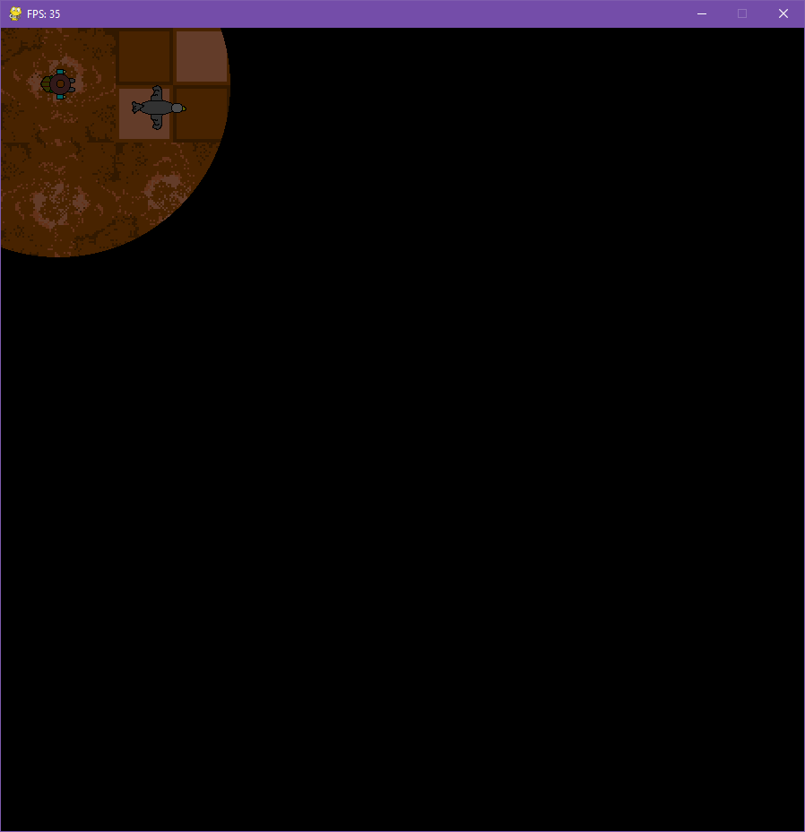

# pygame-pygame_ai-game Teaching Project
This repository and game was created for a one time class I taught about creating a simple game world. The goal of this class was to get the students to create a simple game world for a bare-bones pygame I created. The slides I lectured from can be found here: https://github.com/Saccharine-Coal/pygame-pygame_ai-game/blob/main/docs/teaching-slides-trim.pdf

# 1st iteration of the game
- Map element
- Player element

# 2nd iteration of the game
- Map element
- Player element
- Goal element

# 3rd iteration of the game
- Map element
- Player element
- Goal element
- Fog of war element

# 4th iteration of the game
- Map element
- Player element
- Goal element
- Fog of war element
- Enemy element

# Final iteration of the game
- Map element
- Player element
- Goal element
- Fog of war element
- Enemy element
- Sprite work

# Dependencies
- Python 3
- Pygame version 2.0 
- Pygame ai
